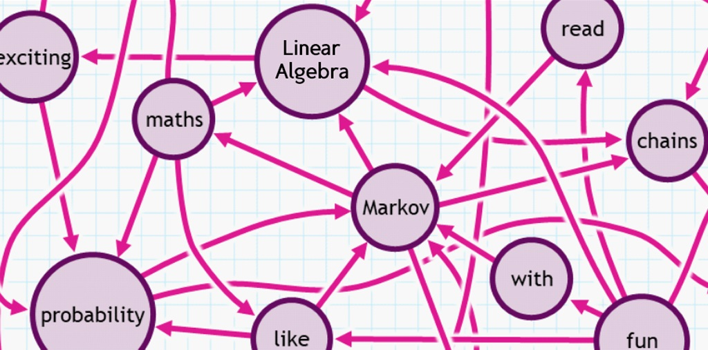

# Markov Matrices: Business Cycle

*Linear Algebra (ECE) | Spring 2023 | Dr. Sarafraz | University of Tehran*

*A Project Designed by: [Erfan Asgari](https://github.com/erfanasgari21), [Fardin Abbasi](https://github.com/fardinabbasi)*

This project explores the application of Markov Chains to model the dynamics of business cycles, a fundamental topic in macroeconomics. By utilizing matrix operations and eigenvalue decomposition, students will analyze how economic states transition over time and simulate long-term outcomes.



Also Available in [PDF](Description-En.pdf) Format.

## Introduction to Markov Chains

In a hypothetical country, every decade, $5$ percent of the rural population migrates to cities and $0.1$ percent of city dwellers migrate back to rural areas.

### 1- Deriving Population Transition Equations
Write the algebraic relation for the future population shares of cities ($c_{t+1}$) and rural areas ($v_{t+1}$) in terms of the current population shares of cities ($c_{t}$) and rural areas ($v_{t}$).

### 2- Matrix Representation of Population Dynamics

Define the population distribution vector as

$$
p_t =
\begin{pmatrix}
c_t \\
v_t \\
\end{pmatrix}
$$

Rewrite the relation for $p_{t+1}$ in terms of a matrix multiplication.

### 3- Explicit Representation

Assuming the vector $p_0$ represents the population distribution at the initial time and $p_t$ represents the population distribution after $t$ decades, what is the relation of $p_t$ in terms of $p_0$?

> [!NOTE]
> Matrices like the coefficient matrix in this problem, which are square and represent probabilities, are called **Markov Matrices**.

### 4- Identifying Markov Matrices

Based on the concept of Markov matrices and the matrix properties you formed in the previous problem, which of the following matrices is a Markov matrix? Describe two properties of Markov matrices according to probability principles.

$$
A_1 =
\begin{bmatrix}
0.2 & 0.2 & 0.6 \\
0.3 & 0.5 & 0.2 \\
0.5 & 0.2 & 0.3 \\
\end{bmatrix}
\quad
A_2 =
\begin{bmatrix}
-0.1 & 0 & 0.2 \\
0.4 & 0.8 & 1.2 \\
0.7 & 0.2 & -0.4 \\
\end{bmatrix}
\quad
A_3 =
\begin{bmatrix}
0.25 & 0.3 & 0.1 \\
0.1 & 0.5 & 0 \\
0.65 & 0.2 & 0.9 \\
\end{bmatrix}
$$

### 5- Properties of Markov Matrices: Eigenvalues and Eigenvectors

Given the two properties of Markov matrices, show that:

a) Every Markov matrix has an eigenvalue equal to 1.

b) The eigenvalues of a Markov matrix are not greater than 1. 

*Hint: For which entry of $`A^T v`$ cannot be greater than the entry of $`v`$?*

> ### Definition
> A **Stochastic Vector** represents a discrete probability distribution with non-negative entries that sum to 1. Each entry of this vector represents the probability of one of the possible outcomes in a conventional ordering.

The figure below shows a **Markov Chain** with two states. The initial probability of being in each state is denoted by the probability vector $p_0$, known as the initial state distribution. In a Markov Chain, the transition probability to each state depends only on the current state. Thus, the chain can be described with a 2x2 Markov matrix, similar to Question 1.


Here, a more formal definition for the probability vector and transition matrix, which is a Markov matrix, is provided:

```math
p_t =
\begin{pmatrix}
Pr\{S_t=1\} \\
Pr\{S_t=2\} \\
\end{pmatrix}
A =
\begin{bmatrix}
Pr\{S_t=1 | S_{t-1}=1\} & Pr\{S_t=1 | S_{t-1}=2\} \\ 
Pr\{S_t=2 | S_{t-1}=1\} & Pr\{S_t=2 | S_{t-1}=2\} \\
\end{bmatrix}
=
\begin{bmatrix}
1-\alpha & \beta \\ 
\alpha & 1-\beta \\
\end{bmatrix}
```

If the initial state distribution is given as

$$
p_0 =
\begin{pmatrix}
0.3 \\
0.7 \\
\end{pmatrix}
$$

this means that initially, there is a $0.3$ probability of being in state $S_1$ and a $0.7$ probability of being in state $S_2$. This probability distribution changes to $p_1 = A p_t$ in the next moment, representing the probability of being in each state at the next moment.

> [!TIP]
> An optional study of this [interactive booklet](https://setosa.io/ev/markov-chains/) may help in understanding the concept of Markov chains.

## Introduction to Numerical Methods

### 6- Numerical Analysis and Visualization

For the matrix 

$$
A =
\begin{bmatrix}
0.6 & 0.5 \\ 
0.1 & 1 \\
\end{bmatrix}
$$

plot the vectors $v, Av, A^2v, A^3v, \ldots, A^{10}v$ for three values of 

$$
v_1 =
\begin{pmatrix}
1 \\ 
0.5 \\
\end{pmatrix}
\quad
v_2 =
\begin{pmatrix}
-2 \\ 
1 \\
\end{pmatrix}
\quad
v_3 =
\begin{pmatrix}
2 \\ 
-1 \\
\end{pmatrix}
$$

in separate plots. Also, find the eigenvalues and eigenvectors of this matrix using built-in functions, and show the direction of the eigenvectors as lines on these plots.

Based on the plots, what direction does $`A^N v`$ tend towards as $`N`$ increases?

### 7- Decomposing Vectors and Eigenvalue Analysis

Explain the observed behavior in the previous question by decomposing a hypothetical vector $v$ along the eigenvectors and find an exceptional case.

### 8- Iterative Methods for Eigenvalue Computation

Based on the result from the previous question, suggest a method to find an eigenvector and eigenvalue of a matrix using iterative matrix multiplication. Which eigenvalue and eigenvector does this method find? Write a function that, given a matrix and the number of iterations as input, finds and returns the corresponding eigenvector and eigenvalue using the suggested method. Test your function and compare the results with built-in functions.

> [!WARNING]
> Your function should not suffer from numerical instability for very large or small numbers of iterations or eigenvalues.

### 9- Effect of Matrix Modifications on Eigenpairs

Given the set of eigenvalues $`\{\lambda_1, \ldots, \lambda_n \}`$ and eigenvectors $`\{ v_1, \ldots, v_n \}`$ of matrix $`A`$, infer the eigenvalues and eigenvectors of matrix $`A - \mu I`$ and $`A^{-1}`$.

### 10- Inverse Iteration Method

Investigate the inverse iteration method, which is a technique for finding eigenvalues and eigenvectors of a matrix, and explain its logic using the results of the previous question. Implement this method in a function with the assumption that a shift value is provided as input. How does this method overcome the limitation of the power iteration method?

### 11- Monte Carlo Method

In cases where the formulation of a probabilistic problem is complex or some values are unknown, the **Monte Carlo Estimation** method can be useful for obtaining certain variables through experiments and sampling. Briefly explain the use of this method in estimating the value of $\pi$ based on this [interactive booklet](https://observablehq.com/@jajoosam/mathe-carlo/2).

### 12- Monte Carlo Methods for Probabilistic Estimation

In a Markov chain, the steady state distribution is a vector to which the probability distribution vector tends as $`t \to \infty`$. Based on what you learned from the Monte Carlo method, suggest a method to estimate the steady state distribution in a Markov chain using simulation and sampling.

> [!WARNING]
> The proposed method should not use matrix multiplication and should only rely on sampling from probability distributions.

## Business Cycle

The **Business Cycle** is one of the key topics in macroeconomics. It refers to a series of stages in the economy that continuously repeat, characterized by expansion and contraction. Governments can make better policy decisions by understanding the different mechanisms of this cycle.


Each business cycle passes through four distinct phases:

#### Expansion/Recovery
Expansion or recovery is the most favorable economic state, characterized by business booms.

#### Peak
At this stage, economic parameters have increased or decreased excessively, and the economy begins to grow uncontrollably. This imbalance signals the start of a recession or contraction phase.

#### Recession/Depression
The contraction phase is associated with reduced economic activity. During this period, unemployment usually rises, stock markets fall, and GDP growth drops below 2%.

#### Trough
This phase is the exact opposite of the peak. The cycle reaches the trough when the recession ends, and the economy starts returning to an expansion phase.

In this project, we refer to the state between peak and trough as the **average** state.

> [!TIP]
> ### The Trading Game 
> Similar cycles can be observed in all economic areas! For example, the **Product Life Cycle** follows a similar pattern in microeconomics when introducing a product to the market. Similar behavior can also be found in stock markets. Try to maximize your profits in this [stock market simulation](https://www.bloomberg.com/features/2015-stock-chart-trading-game/)!

### Markov Chain Graph

Below is a Markov chain graph of a business cycle for a specific country. Each arrow represents the probability of transitioning from one state to another in a given month. It is also possible to remain in the current state.


### 13- Extracting the Transition Matrix
Extract the transition matrix from the graph:

$$
A = \begin{pmatrix}
\text{State} & \text{Trough} & \text{Average} & \text{Peak} \\\
\text{Trough} & ? & ? & ? \\\
\text{Average} & ? & ? & ? \\\
\text{Peak} & ? & ? & ?
\end{pmatrix}
$$

### 14- Eigenvalues and Eigenvectors
Find the eigenvalues and eigenvectors of this Markov matrix. Normalize the eigenvectors so they become probability vectors.

### 15- Monte Carlo Simulation
If, based on current government policies, the initial state distribution vector is:

$$
p_0 = 
\begin{pmatrix}
0.2 \\\
0.5 \\\
0.3
\end{pmatrix}
$$

Using 1000 samples from this distribution, create a sample set for the current month. Assuming current government policies remain, predict the state distribution for 6, 12, 72, and 120 months into the future using the **Monte Carlo Estimation** method.

### 16- Long-term State Prediction
Without the need for statistical simulations, Markov chains allow predicting future state distributions using only the transition matrix. The government may have three possible state distributions this month:

$$
p_a = \begin{pmatrix}
0.1 \\\ 0.8 \\\ 0.1
\end{pmatrix}
\quad
p_b = \begin{pmatrix}
0.6 \\\ 0.3 \\\ 0.1
\end{pmatrix}
\quad
p_c = \begin{pmatrix}
0.1 \\\ 0.15 \\\ 0.75 
\end{pmatrix}
$$

Using matrix multiplication, calculate the long-term results (over 120 months) for each of these policies. Plot a **3D scatter plot** showing the probability distribution for each policy over time.

> [!WARNING]
> Make sure the plot includes enough detail, including a title, axis labels, and a legend.

### 17- Steady-State Distribution
The steady-state distribution is the long-term probability distribution. Based on your results, argue whether the initial state distribution affects the steady-state distribution.

### 18- Steady-State and Eigenvalues
Using what you have learned about the eigenvalues of Markov matrices and the **power iteration method**, explain the relationship between the steady-state distribution and the eigenvalues and eigenvectors of the transition matrix.

### 19- Finding the Steady-State Distribution
Another definition of the steady-state distribution is that it does not change over time, i.e., $`p_{t+1} = p_t`$. Using this definition and the result of Exercise 2, form the system of equations to find the steady-state distribution $`p_{ss}`$ in the standard form $`Ax = b`$. Explain why this equation does not have a unique solution in its current form.

### 20- Adding a Constraint
What assumption about the sum of the elements in $`p_{ss}`$ was missing in the previous formulation? By adding this assumption as a new equation, rewrite the coefficient matrix and the constants. Solve the system using built-in functions and compare the result with Exercise 14.
