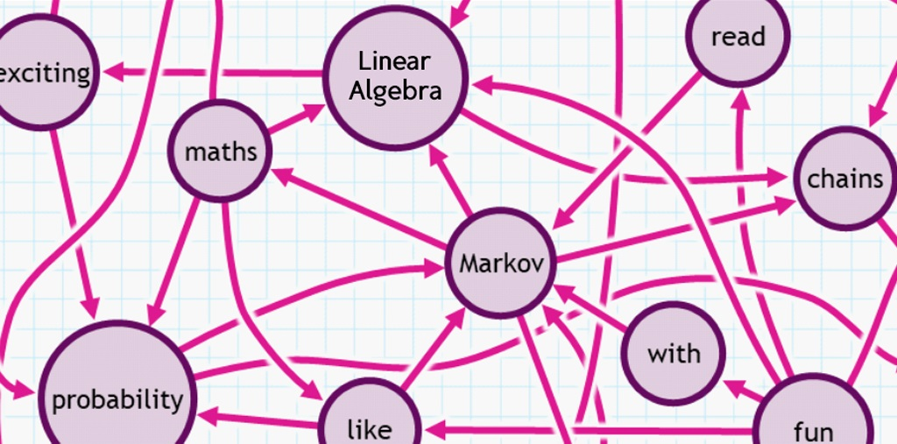
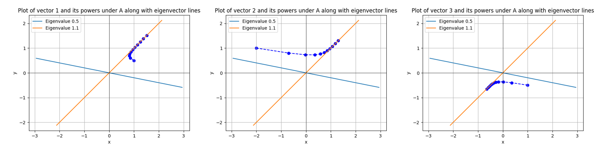
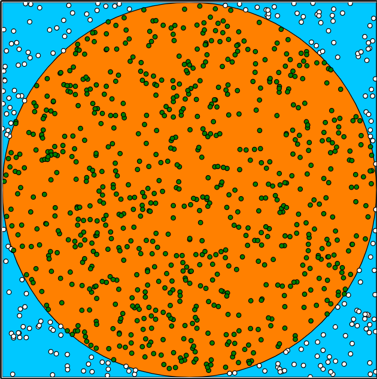
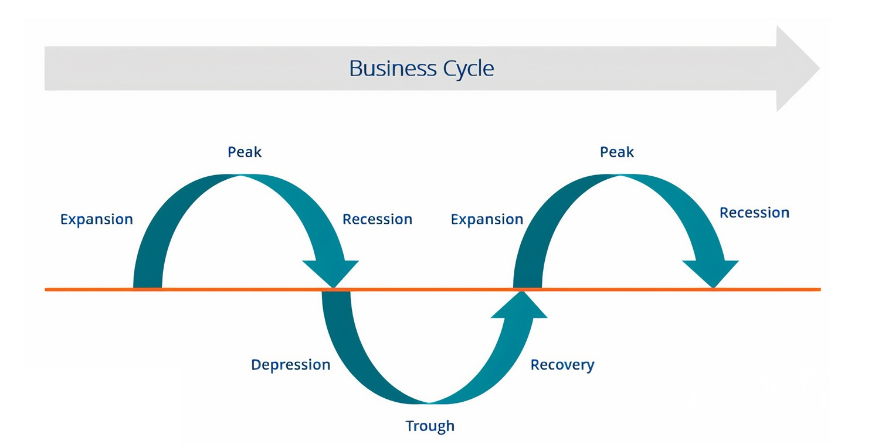
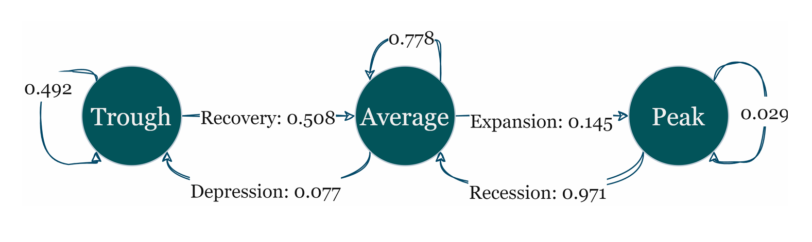
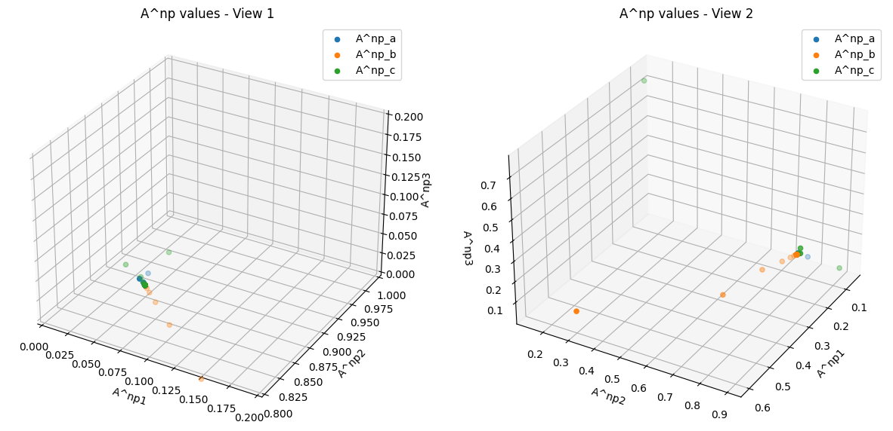

# Markov Matrices: Business Cycle

*Linear Algebra (ECE) | Spring 2024 | Dr. Sarafraz | University of Tehran*

*A Project Designed by: [Erfan Asgari](https://github.com/erfanasgari21), [Fardin Abbasi](https://github.com/fardinabbasi)*



This project explores the application of Markov Chains to model the dynamics of business cycles, a fundamental topic in macroeconomics. By utilizing matrix operations and eigenvalue decomposition, students will analyze how economic states transition over time and simulate long-term outcomes. 

#### Objectives

- To understand the role of Markov matrices in modeling real-world phenomena like the business cycle.
- To explore key linear algebra concepts, including eigenvalues, eigenvectors, and matrix multiplication.
- To apply the Monte Carlo method and steady-state analysis in the context of Markov Chains.
- To gain familiarity with numerical methods such as power iteration and inverse iteration for computing eigenvalues and eigenvectors.

#### Links
- [Project Description (En)](Description-En.md)
- [Original Description (Fa)](Description-Fa.pdf)
- [Implementation Code (ipynb)](Code.ipynb)


## Introduction to Markov Chains

### Rural and Urban Migration Example
In a hypothetical country, every decade, $5$ percent of the rural population migrates to cities and $0.1$ percent of city dwellers migrate back to rural areas.

Writing the algebraic relation for the future population shares of cities ($c_{t+1}$) and rural areas ($v_{t+1}$) in terms of the current population shares of cities ($c_{t}$) and rural areas ($v_{t}$):

$$
c_{t+1}=0.95c_t+0.2v_t
$$

$$
v_{t+1}=0.05v_t+0.8v_t
$$

Next, let's define the population distribution vector as

$$
p_t =
\begin{pmatrix}
c_t \\
v_t \\
\end{pmatrix}
$$

Rewriting the relation for $p_{t+1}$ in terms of a matrix multiplication:

$$
\left(
\begin{matrix}c_{t+1}\\\v_{t+1}\\end{matrix}
\right)=
\left[
\begin{matrix}0.95&0.2\\\0.05&0.8\\end{matrix}
\right]
\left(
\begin{matrix}c_t\\\v_t\\end{matrix}
\right)
$$

$$
p_{t+1}=Ap_t
$$

### Explicit Representation

Assuming the vector $p_0$ represents the population distribution at the initial time and $p_t$ represents the population distribution after $t$ decades:

$$ 
p_t=A^tp_0 
$$

> [!NOTE]
> Matrices like the coefficient matrix in this problem, which are square and represent probabilities, are called **Markov Matrices**.

A **Markov matrix** must satisfy two key properties according to probability theory:

1. **Non-negative Entries**: All entries in a Markov matrix represent probabilities, meaning they must be between 0 and 1, inclusive. Negative values or values greater than 1 violate the probability constraints.
   
2. **Column Sum Equals 1**: The sum of the probabilities in each column must equal 1. This ensures that for each possible state, the total probability of transitioning to all other states sums to 1, reflecting the fact that some transition must occur.

These two properties ensure that a matrix can model a valid Markov process where each state evolves probabilistically to the next.

### Properties of Markov Matrices: Eigenvalues and Eigenvectors

Given the two properties of Markov matrices, it can be shown that:

a) Every Markov matrix has an eigenvalue equal to 1.

b) The eigenvalues of a Markov matrix are not greater than 1. 

> ### Definition
> A **Stochastic Vector** represents a discrete probability distribution with non-negative entries that sum to 1. Each entry of this vector represents the probability of one of the possible outcomes in a conventional ordering.

### Markov Chain

The figure below shows a **Markov Chain** with two states. The initial probability of being in each state is denoted by the probability vector $p_0$, known as the initial state distribution. In a Markov Chain, the transition probability to each state depends only on the current state. Thus, the chain can be described with a 2x2 Markov matrix, similar to Question 1.


Here, a more formal definition for the probability vector and transition matrix, which is a Markov matrix, is provided:

```math
p_t =
\begin{pmatrix}
Pr\{S_t=1\} \\
Pr\{S_t=2\} \\
\end{pmatrix}
A =
\begin{bmatrix}
Pr\{S_t=1 | S_{t-1}=1\} & Pr\{S_t=1 | S_{t-1}=2\} \\ 
Pr\{S_t=2 | S_{t-1}=1\} & Pr\{S_t=2 | S_{t-1}=2\} \\
\end{bmatrix}
=
\begin{bmatrix}
1-\alpha & \beta \\ 
\alpha & 1-\beta \\
\end{bmatrix}
```

If the initial state distribution is given as

$$
p_0 =
\begin{pmatrix}
0.3 \\
0.7 \\
\end{pmatrix}
$$

this means that initially, there is a $0.3$ probability of being in state $S_1$ and a $0.7$ probability of being in state $S_2$. This probability distribution changes to $p_1 = A p_t$ in the next moment, representing the probability of being in each state at the next moment.

> [!TIP]
> An optional study of this [interactive booklet](https://setosa.io/ev/markov-chains/) may help in understanding the concept of Markov chains.

## Introduction to Numerical Methods

For the matrix 

$$
A =
\begin{bmatrix}
0.6 & 0.5 \\ 
0.1 & 1 \\
\end{bmatrix}
$$

let's plot the vectors $v, Av, A^2v, A^3v, \ldots, A^{10}v$ for three values of

$$
v_1 =
\begin{pmatrix}
1 \\ 
0.5 \\
\end{pmatrix}
\quad
v_2 =
\begin{pmatrix}
-2 \\ 
1 \\
\end{pmatrix}
\quad
v_3 =
\begin{pmatrix}
2 \\ 
-1 \\
\end{pmatrix}
$$

in separate plots and show the direction of the eigenvectors as lines on these plots.


As shown in the diagrams, this vector converges toward the direction of the eigenvector corresponding to the "dominant" eigenvalue, which is the eigenvalue with the largest magnitude.

### Decomposing Vectors and Eigenvalue Analysis

By decomposing this vector along the unit eigenvectors, we have:

$$ 
w = \alpha_1 v_1 + \alpha_2 v_2 
$$

Multiplying the matrix $A$ by the vector $w$:

$$
Aw = \alpha_1 (Av_1) + \alpha_2 (Av_2) = \alpha_1 (\lambda_1 v_1) + \alpha_2 (\lambda_2 v_2) 
$$

After $N$ iterations:

$$
A^N w = \lambda_1^N (\alpha_1 v_1) + \lambda_2^N (\alpha_2 v_2)
$$

Without loss of generality, we assume that the first eigenvalue $` \lambda_1 `$ is larger. Since scaling does not affect the direction, we divide by $` \lambda_1^N `$:

$$
\frac{A^N w}{\lambda_1^N} = \frac{\lambda_1^N}{\lambda_1^N} (\alpha_1 v_1) + \frac{\lambda_2^N}{\lambda_1^N} (\alpha_2 v_2)
$$

In this formulation, the coefficient of the second eigenvector tends to zero as $N$ approaches infinity:

$$
\lim_{N \rightarrow \infty} \left( \frac{\lambda_2}{\lambda_1} \right)^N = 0
$$

This implies that as $` N \to \infty `$, the vector converges to the direction of the first eigenvector.

### Iterative Methods for Eigenvalue Computation

Based on the result from the previous part, we can suggest a method to find an eigenvector and eigenvalue of a matrix using iterative matrix multiplication: 

```python
def power_iteration(A, num_iterations=100):
    n = A.shape[0]
    v = np.random.rand(n)

    for _ in range(num_iterations):
        # Calculate Av
        Av = np.dot(A, v)

        # Normalize Av
        v = Av / np.linalg.norm(Av)

    # Calculate the eigenvalue
    eigenvalue = np.dot(np.dot(v, A), v) / np.dot(v, v)

    return eigenvalue, v
```

This method is known as **"Power Iteration"** method and can only find the largest eigenvalue and its corresponding eigenvector.

### Two Properties of Eigenpairs

Given the set of eigenvalues $`\{\lambda_1, \ldots, \lambda_n \}`$ and eigenvectors $`\{ v_1, \ldots, v_n \}`$ of matrix $`A`$, we can infer the eigenvalues and eigenvectors of matrix a) $`A - \mu I`$ and b) $`A^{-1}`$:

#### Eigenpairs for $`A - \mu I`$

Each eigenvector $`v_i`$ satisfies the following equation:

$$
A v_i = \lambda_i v_i
$$

Subtracting $`\mu v_i`$ from both sides:

$$
A v_i - \mu v_i = \lambda_i v_i - \mu v_i
$$

Factoring gives:

$$
\left(A - \mu I \right)v_i = \left(\lambda_i - \mu \right)v_i
$$

Thus, the matrix $`A - \mu I`$ has the same eigenvectors $`\{v_i\} `$, but its eigenvalues are $` \{\lambda_i - \mu\} `$.

#### Eigenpairs for $`A^{-1}`$

Multiply both sides of the eigenvalue equation for $` A `$ by $` A^{-1} `$:

$$
A^{-1} A v_i = A^{-1} (\lambda_i v_i)
$$

Since $` A^{-1} A = I `$:

$$
v_i = \lambda_i A^{-1} v_i
$$

Solving for $` A^{-1} v_i `$:

$$
A^{-1} v_i = \frac{1}{\lambda_i} v_i
$$

Therefore, the eigenvalue $` \mu_i `$ of $` A^{-1} `$ is $` \frac{1}{\lambda_i} `$.

### Inverse Iteration Method

The inverse iteration method is a technique for finding eigenvalues and eigenvectors of a matrix, particularly when used in conjunction with a shift to focus on a particular eigenvalue. It builds on the properties of eigenpairs that we discussed earlier. Here’s how the inverse iteration method leverages these properties and can be adapted to find all eigenpairs, not just one.

Inverse iteration, also known as the inverse power method, focuses on finding the eigenvalue of a matrix that is closest to a given shift value. It works by iterating the solution of a linear system involving $` (A - \sigma I) `$, where $` \sigma `$ is a shift value. This method is particularly useful for finding eigenvalues that are not necessarily the largest in magnitude, which is a limitation of the power iteration method.

- **Eigenpairs of $` A - \sigma I `$**: If $` A v_i = \lambda_i v_i `$, then $` (A - \sigma I) v_i = (\lambda_i - \sigma) v_i `$. For $` \lambda_i `$ near $` \sigma `$, $` (\lambda_i - \sigma) `$ is small, and the matrix $` (A - \sigma I) `$ has a small eigenvalue, making $` (A - \sigma I)^{-1} `$ amplify the corresponding eigenvector $` v_i `$.
- **Eigenpairs of $` (A - \sigma I)^{-1} `$**: The eigenvectors of $` (A - \sigma I)^{-1} `$ are the same as those of $` A `$, but the eigenvalues are $` \frac{1}{\lambda_i - \sigma} `$. This means that if you perform inverse iteration, you are effectively amplifying the eigenvector corresponding to the eigenvalue of $A$ closest to $` \sigma `$.

#### Finding All Eigenpairs

To find all eigenpairs, not just the one closest to a shift value, you can use a combination of techniques:

1. **Shift Strategies:**

   By choosing different shift values $` \sigma `$, you can use inverse iteration to find eigenvectors corresponding to eigenvalues near each shift. You may need to use different shifts to target different eigenvalues.

2. **Deflation:**

   After finding an eigenpair, deflate the matrix $A$ to remove the effect of the found eigenpair and repeat the process on the reduced matrix. This technique involves subtracting the outer product of the found eigenvector from $A$ and solving the reduced system.

```python
import numpy as np

def inverse_iteration(A, num_iterations=100, shift=0):
    n = A.shape[0]
    v = np.random.rand(n)

    for _ in range(num_iterations):
        # Solve (A - shift*I)x = v
        x = np.linalg.solve(A - shift * np.eye(n), v)
        
        # Normalize x
        v = x / np.linalg.norm(x)

    # Calculate the eigenvalue
    eigenvalue = np.dot(np.dot(v, A), v) / np.dot(v, v)
    
    return eigenvalue, v
```

## Monte Carlo Method

The **Monte Carlo Estimation** method is a powerful tool for approximating values through random sampling and simulation. One classic example of its application is estimating the value of $` \pi `$. The interactive booklet demonstrates this by using the following approach:

1. **Setup**: Imagine a circle inscribed within a square. The area of the circle is $` \pi r^2 `$, and the area of the square is $` (2r)^2 `$, where $` r `$ is the radius of the circle.

2. **Random Sampling**: Randomly generate points within the square. For each point, determine if it falls inside the circle.



3. **Estimate $` \pi `$**: The ratio of the number of points inside the circle to the total number of points approximates the ratio of the area of the circle to the area of the square. Since the area of the circle is $` \pi r^2 `$ and the area of the square is $` (2r)^2 `$, the ratio is $` \frac{\pi r^2}{4r^2} = \frac{\pi}{4} `$. Multiply this ratio by 4 to estimate $` \pi `$.

By repeating this sampling process many times, the estimate of $` \pi `$ becomes more accurate.

> [!TIP]
> Take a look at this [Interactive Notebook](https://observablehq.com/@jajoosam/mathe-carlo/2) to know more about classic examples of Monte Carlo.


#### Monte Carlo Methods for Probabilistic Estimation

To estimate the steady state distribution of a Markov chain using the Monte Carlo method, you can use the following simulation-based approach:

1. **Initialize**: Start with an initial state $` x_0 `$ randomly chosen from the state space of the Markov chain.

2. **Simulation**: Perform a large number of transitions according to the Markov chain's transition probabilities. For each step, sample the next state based on the current state using the transition matrix.

3. **Record Frequencies**: Track the frequency of each state visited over a large number of transitions. The more transitions you simulate, the closer these frequencies will approximate the steady state probabilities.

4. **Estimate Steady State Distribution**: After a sufficient number of transitions, the proportion of time spent in each state will estimate the steady state distribution. Normalize these frequencies to ensure they sum to 1.

This method relies solely on sampling and simulation, avoiding direct matrix computations. It provides a practical way to estimate the steady state distribution for complex Markov chains where analytical solutions may be infeasible.

## Business Cycle

The **Business Cycle** is one of the key topics in macroeconomics. It refers to a series of stages in the economy that continuously repeat, characterized by expansion and contraction. Governments can make better policy decisions by understanding the different mechanisms of this cycle.



Each business cycle passes through four distinct phases:

#### Expansion/Recovery
Expansion or recovery is the most favorable economic state, characterized by business booms.

#### Peak
At this stage, economic parameters have increased or decreased excessively, and the economy begins to grow uncontrollably. This imbalance signals the start of a recession or contraction phase.

#### Recession/Depression
The contraction phase is associated with reduced economic activity. During this period, unemployment usually rises, stock markets fall, and GDP growth drops below 2%.

#### Trough
This phase is the exact opposite of the peak. The cycle reaches the trough when the recession ends, and the economy starts returning to an expansion phase.

In this project, we refer to the state between peak and trough as the **average** state.

> [!TIP]
> #### The Trading Game
> Similar cycles can be observed in all economic areas! For example, the **Product Life Cycle** follows a similar pattern in microeconomics when introducing a product to the market. Similar behavior can also be found in stock markets. Try to maximize your profits in this [stock market simulation](https://www.bloomberg.com/features/2015-stock-chart-trading-game/)!

### Markov Chain Graph

Below is a Markov chain graph of a business cycle for a specific country. Each arrow represents the probability of transitioning from one state to another in a given month. It is also possible to remain in the current state.



#### Extracting the Transition Matrix

Using the graph, we can extract the transition matrix:

$$
A = \begin{pmatrix}
\text{State} & \text{Trough} & \text{Average} & \text{Peak} \\\
\text{Trough} & 0.492 & 0.077 & 0 \\\
\text{Average} & 0.508 & 0.778 & 0.971 \\\
\text{Peak} & 0 & 0.145 & 0.029
\end{pmatrix}
$$

Finding the eigenvalues and eigenvectors of this Markov matrix and then normalizing the first eigenvector so they become probability vectors:

$$
\lambda_1=1.000, v_1=
\left[
\begin{matrix}0.1165\\\0.7687\\\0.1148\\end{matrix}
\right] 
$$

$$
\lambda_2=0.435, v_2=
\left[
\begin{matrix}0.7875 \\\ -0.5803 \\\ -0.2071 \\end{matrix}
\right]
$$

$$
\lambda_3=0.435, v_3=
\left[
\begin{matrix} 0.0917 \\\ -0.7484 \\\ 0.6567 \\end{matrix}
\right]
$$

### Monte Carlo Estimation

If, based on current government policies, the initial state distribution vector is:

$$
p_0 = 
\begin{pmatrix}
0.2 \\\
0.5 \\\
0.3
\end{pmatrix}
$$

Using 1000 samples from this distribution, we can create a sample set for the current month. Assuming current government policies remain, we predict the state distribution for 6, 12, 72, and 120 months into the future using the **Monte Carlo Estimation** method:

```python
initial_distribution = np.array([0.2, 0.5, 0.3])
num_simulations = 1000

def monte_carlo_markov_chain(
    transition_matrix, 
    initial_distribution, 
    num_steps, 
    num_simulations):
    
    num_states = len(initial_distribution)
    state_counts = np.zeros(num_states)
    
    for _ in range(num_simulations):
        current_state = np.random.choice(range(num_states), p=initial_distribution)
        for _ in range(num_steps):
            current_state = np.random.choice(range(num_states), p=transition_matrix[:,current_state])
        state_counts[current_state] += 1
    
    state_probabilities = state_counts / (num_simulations)
    
    return state_probabilities
```

State Steady States after:
- 6 months: `[0.126 0.752 0.122]`
- 12 months: `[0.113 0.771 0.116]`
- 72 months: `[0.109 0.795 0.096]`
- 120 months:  `[0.125 0.761 0.114]`


### Long-term State Prediction
Without the need for statistical simulations, Markov chains allow predicting future state distributions using only the transition matrix. The government may have three possible state distributions this month:

$$
p_a = \begin{pmatrix}
0.1 \\\ 0.8 \\\ 0.1
\end{pmatrix}
\quad
p_b = \begin{pmatrix}
0.6 \\\ 0.3 \\\ 0.1
\end{pmatrix}
\quad
p_c = \begin{pmatrix}
0.1 \\\ 0.15 \\\ 0.75 
\end{pmatrix}
$$

Using matrix multiplication, we calculate the long-term results (over 120 months) for each of these policies, plotting a **3D scatter plot** showing the probability distribution for each policy over time.



The steady-state distribution of a Markov chain is a key concept representing the long-term behavior of the system. It describes the probability distribution over states when the chain has reached equilibrium, meaning that the probabilities of being in each state no longer change as the system evolves.

### Independence of Initial State
The steady-state distribution is independent of the initial state distribution. This is a fundamental property of Markov chains. Regardless of where the Markov chain starts, after a sufficiently long time, the probability distribution over states will converge to the steady-state distribution.

#### Convergence to Steady-State
In a Markov chain, as time progresses, the influence of the initial state distribution diminishes. The chain will converge to the steady-state distribution, which is a stationary distribution that satisfies:

$$
p = Ap
$$

This equation implies that once the chain reaches the steady-state, the distribution over states does not change with further transitions.

#### Long-Term Behavior
The steady-state distribution represents the long-term equilibrium of the Markov chain. For any initial state, as the number of transitions increases, the probability of being in each state converges to the steady-state probabilities. This convergence is independent of the initial state because the steady-state distribution is defined by the transition matrix alone.

The initial state distribution does not affect the steady-state distribution. The steady-state distribution is a property of the transition matrix and represents the equilibrium distribution that the Markov chain converges to regardless of its starting point. This ensures that in the long run, the system behaves consistently and independently of where it started.

### As a System of Equations

Another definition of the steady-state distribution is that it does not change over time, i.e., $`p_{t+1} = p_t`$. Using this definition we can form a system of equations to find the steady-state distribution $`p_{ss}`$ in the standard form $`Ax = b`$:

$$
p_{t+1} = Ap_t = p_t 
$$

$$
(A-I)p_t=0
$$

It can be observed that $` A - I `$ has a determinant of zero because 1 is an eigenvalue of any Markov matrix. Consequently, this matrix is not invertible, which implies that the system of equations does not have a unique solution.

#### Adding a Constraint
What assumption about the sum of the elements in $` p_{ss} `$ was missing in the previous formulation? The sum of the elements in $` p_{ss} `$ is constant and equals 1. By adding this condition to the system of equations, the solution can be obtained using the pseudo-inverse method:

$$
\left[\begin{matrix}
A - I \\
1^T
\end{matrix}\right] p = \left[\begin{matrix}
0 \\
1
\end{matrix}\right]
$$
